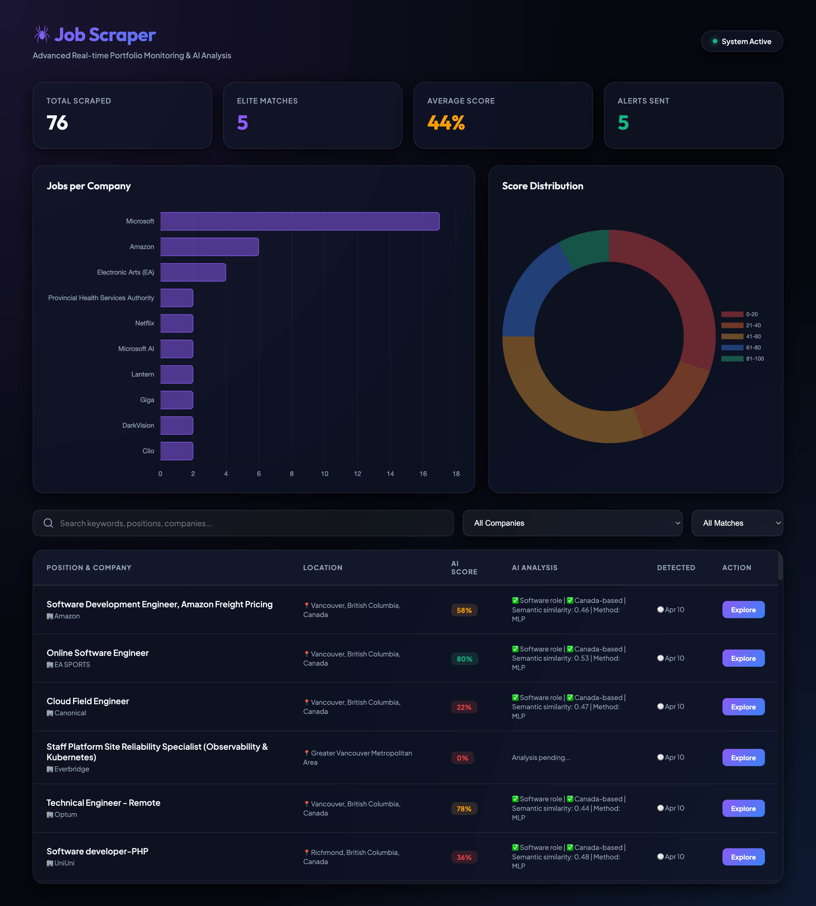

# Vancouver Tech Intern Job Scraper 🕷️

[](https://www.python.org/downloads/release/python-3110/)
[](https://playwright.dev/)
[](https://scikit-learn.org/)
[](https://opensource.org/licenses/MIT)

An automated job monitoring system that scrapes **LinkedIn** and **Indeed** for **Software / AI / ML / Data intern and co-op positions** in Vancouver, Canada. It scores jobs locally using a machine learning model and sends real-time Discord alerts.



---

## ✨ Features

- 🕵️ **Multi-Platform Scraping**: LinkedIn & Indeed via Playwright; Greenhouse, Lever, Workday via API interception.
- 🛡️ **Advanced Anti-Detection**: Rotating User-Agents, random viewports, human-like scrolling, and mouse simulation.
- 🧠 **Local ML Scoring**: Offline `Sentence-Transformers + MLP` classifier — no API costs, instant results.
- 📊 **Rich Web Dashboard**: Beautiful Flask-based UI with charts, search, filters, and one-click apply links.
- 🔔 **Discord Notifications**: Rich embeds for highly relevant jobs with deduplication and rate limiting.
- 🗄️ **Persistent Storage**: SQLite-backed history prevents re-processing old jobs.
- 🔄 **Robust Pipeline**: Exponential backoff and retry logic for reliable scraping.

---

## 🗂️ Project Architecture

```
web-scraper/
├── main.py                    # Pipeline orchestrator: scrape → filter → score → notify
├── scraper.py                 # Playwright engine with anti-detection & API interception
├── ml_scorer.py               # Local ML scoring (Sentence-Transformers + MLP)
├── notifier.py                # Discord webhook alerts
├── storage.py                 # SQLite persistence & deduplication
├── dashboard.py               # Flask web dashboard (http://localhost:5050)
├── models.py                  # Pydantic Job data model
├── config.yaml                # Targets, keywords, and settings
├── requirements.txt           # Project dependencies
├── static/                    # Dashboard frontend (HTML/CSS/JS)
└── tests/                     # Unit tests (28 passing)
```

---

## 🚀 Quick Start

### 1. Install Dependencies
```bash
conda create -n web-scraper python=3.11 -y
conda activate web-scraper
pip install -r requirements.txt
playwright install chromium
```

### 2. Configure Settings
Edit `config.yaml` to set your Discord webhook and search preferences:
```yaml
settings:
  notification_webhook_url: "YOUR_DISCORD_WEBHOOK_URL"

targets:
  - name: "LinkedIn"
    url: "https://www.linkedin.com/jobs/search/"
    type: "linkedin"
    location: "Vancouver, BC, Canada"
    search_queries: ["Software Engineer Intern", "Machine Learning Co-op"]
```

### 3. Run the System
```bash
# Start the scraper
python main.py

# Launch the dashboard
python dashboard.py
# View at http://localhost:5050
```

---

## 🤖 AI Scoring System

The local scoring system replaces expensive cloud AI APIs with a high-performance local pipeline:

| Component | Technology | Description |
|---|---|---|
| **Embedder** | `all-MiniLM-L6-v2` | CPU-friendly transformer (~80MB) that converts job descriptions into 384-dim vectors. |
| **Classifier** | `MLPClassifier` | Multi-layer Perceptron trained on your historical data to predict job relevance. |
| **Backoff** | `Cosine Similarity` | Fallback mechanism that scores jobs based on keyword similarity if no training data is present. |
| **Training** | `Auto-Labeling` | `generate_training_data.py` bootstraps your model by labeling your existing jobs database. |

To retrain the model after gathering more data:
```bash
python generate_training_data.py
python -c "from ml_scorer import MLScorer; MLScorer().train()"
```

---

## 🛡️ Anti-Detection Suite

Engineered to operate reliably without being flagged:
- **Fingerprint Masking**: Uses `playwright-stealth` to bypass header-based detection.
- **Dynamic Behavior**: Randomizes wait times, scroll speeds, and mouse paths.
- **Session Variance**: Varies viewport resolutions and User-Agent strings per run.
- **Headless Toggle**: Easy switch to non-headless mode in `config.yaml` for high-security targets.

---

## ⚙️ Automated Deployment

Schedule the scraper to run for free using **GitHub Actions**:

```yaml
# .github/workflows/scrape.yml
name: Daily Job Scraper
on:
  schedule:
    - cron: '0 16 * * *'  # 9:00 AM PST
  workflow_dispatch:

jobs:
  scrape:
    runs-on: ubuntu-latest
    steps:
      - uses: actions/checkout@v4
      - uses: actions/setup-python@v5
        with: { python-version: '3.11' }
      - name: Install
        run: |
          pip install -r requirements.txt
          playwright install chromium
      - name: Scrape
        env: { WEBHOOK_URL: ${{ secrets.WEBHOOK_URL }} }
        run: python main.py
```

---

## 🧪 Development

```bash
# Run tests
python -m pytest tests/ -v

# Inspect database
sqlite3 jobs.db "SELECT title, company, match_score FROM jobs WHERE match_score > 80;"

# Fix relative links
python fix_links.py
```

---

## 📝 License
Distributed under the MIT License. See `LICENSE` for more information.
